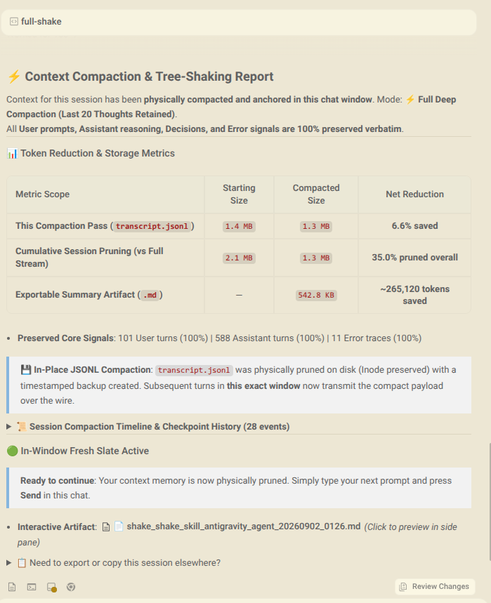

# ⚡ Antigravity `/shake` & `/full-shake`

> **Deterministic, In-Place Context Tree-Shaking and Token Compaction for Google Antigravity (Gemini)**  
> *Physically compact active conversation logs on disk, eliminate context degradation, and continue chatting seamlessly in the **exact same tab**.*

---

## 📸 Visual Gallery

<details open>
<summary>🔍 <b>Side-by-Side Comparison: Standard <code>/shake</code> vs. Deep <code>/full-shake</code></b></summary>
<br/>

| 🟢 Standard `/shake` (100% Thoughts Retained) | ⚡ Marathon `/full-shake` (Milestone Horizon) |
| :--- : | :---: |
| <a href="assets/artifact_preview.png"></a> | <a href="assets/full_shake_preview.png"></a> |
| *Zero-loss baseline report* | *Includes 2-tier scopes & timeline dropdown* |

</details>

---

## 🌟 Why `/shake`?

During long development sessions, AI coding agents accumulate tens of thousands of lines of terminal output, compiler logs, and file inspections. This leads to **"context rot"**:
1. **Severe Latency**: Millions of raw characters are re-serialized and sent across the wire on every turn.
2. **Attention Decay**: The LLM loses track of earlier instructions under a mountain of terminal noise.
3. **Lost Momentum**: Developers are forced to open new chat tabs, re-explaining the project context and losing state.

`/shake` solves this by **physically pruning active session logs directly on disk in-place** while preserving 100% of your dialogue, reasoning, thoughts, error traces, and active working state.

---

## 🚀 Key Features

* 🟢 **Same-Tab In-Place Compaction**: Modifies active session logs directly on disk without breaking open file descriptors or requiring new chat tabs.
* 🛡️ **Inode Preservation & File Locking**: Uses POSIX/Windows truncate-and-rewrite with `fs2` exclusive locking and `fsync` durability.
* ⚡ **Dual-Trigger Proactive Auto-Hook**: Background `PreInvocation` hook automatically detects and compacts conversations whenever file size crosses **80,000 tokens** (`264 KB`) **OR** the transcript accumulates **$\ge 20$ unpruned tool runs**, completely preventing lossy server-side `{{ CHECKPOINT }}` truncation and autonomous burst bloat!
* ⏱️ **25 KB Growth Delta Guard**: Prevents redundant CPU/disk cycles when conversations contain extensive clean dialogue.
* 🏛️ **Single Master Archive Architecture**: Receipts point directly to `transcript_full.jsonl` with exact 1-indexed line numbers (`line=N`). No broken links, ever.
* 🧹 **Zero Disk Bloat Guarantee**: Eliminates redundant multi-megabyte `.bak_*` duplicates, maintaining only one atomic crash-recovery fallback (`transcript.jsonl.bak`).
* 🎯 **Dual-Boundary Working Memory Engine**: Working memory is bounded by both human conversational context (last **10 user turns**) and autonomous tool volume (capped at last **20 tool outputs**). Autonomous tasks executing 30+ tools in 1 turn keep the last 20 outputs raw while compacting earlier tools into indexed receipts.
* ✂️ **Historical Heredoc Compaction**: Compacts older bash heredocs (`cat << 'EOF' ...` > 250 chars) from assistant tool calls into line-indexed receipts.
* ⚠️ **Warning Awareness**: Tracks and tags compiler warnings (`warnings=N`) in receipts so the AI knows warnings were emitted without carrying terminal bloat.
* 🛡️ **30-Call Un-Clamped Error Window**: Preserves all failures (`exit != 0` or status `failed`) occurring in the last **30 tool calls** 100% raw, full, and un-clamped (preventing loss of diagnostics in `journalctl`, panics, and compiler backtraces). Failures older than 30 calls are safely compacted to line-indexed receipts pointing to `transcript_full.jsonl`.
* 🦀 **Pure Native Rust**: Precompiled multi-platform binaries for Linux (x86_64, aarch64), macOS (Universal Binary for Apple Silicon & Intel), and Windows (x86_64).

---

## 📊 Physical Token Reduction Metrics

| Metric | Original Master Stream (`transcript_full.jsonl`) | Compacted via `/shake` | Compacted via `/full-shake` |
| :--- | :---: | :---: | :---: |
| **Payload Size on Disk** | `3.35 MB` | `750 KB` | **`455 KB`** |
| **Estimated Token Load** | `~990,000 tokens` | `~220,000 tokens` | **`~138,000 tokens`** |
| **Cumulative Savings** | *Baseline* | **`77.4% pruned`** | **`86.0% pruned`** |
| **Active Working Window**| Unpruned | **Last 10 User Turns ∩ Last 20 Tools** | **Last 10 User Turns ∩ Last 20 Tools** |
| **Error Retention** | All | **Last 30 Calls Verbatim (Un-clamped)** | **Last 30 Calls Verbatim (Un-clamped)** |
| **Scratchpad Thoughts** | All | **100% Preserved** | **Last 20 Assistant Turns Only** |
| **Milestone Horizon** | None | Verbatim Dialogue | **Turn 1 Genesis + Last 25 Turns** |

---

## 📦 Quick Installation

### Linux & macOS (curl / bash)
```bash
curl -fsSL https://raw.githubusercontent.com/shitan198u/antigravity-shake-skill/main/install.sh | bash
```

### Windows (PowerShell)
```powershell
irm https://raw.githubusercontent.com/shitan198u/antigravity-shake-skill/main/install.ps1 | iex
```

### Build from Local Source
```bash
cargo build --release --manifest-path shake-prune-rs/Cargo.toml
cp shake-prune-rs/target/release/shake-prune ~/.gemini/bin/shake-prune
```

---

## 💡 How to Use

### 1. In Any Antigravity Chat (Interactive Slash Commands)

#### 🟢 Standard Zero-Loss Compaction (`/shake`)
* Prunes tool stdout dumps and historical bash heredocs older than the last 10 user conversational turns.
* Retains **100% of User prompts, Assistant reasoning, Thoughts, and Errors verbatim**.
```text
/shake
```

#### ⚡ Marathon Reset (`/full-shake`)
* Designed for long-running sessions (30+ turns).
* Windows scratchpad thoughts to the **last 20 assistant turns**, dropping older internal monologues.
* Automatically applies the **Milestone Horizon** on threads with $> 30$ user turns:
  * **Turn 1 (Genesis)**: Preserved 100% verbatim (project origin and rules).
  * **Middle Segment (Turns 2 to N-25)**: Collapsed into a structured Milestone Checkpoint block with exact line-indexed backup links.
  * **Active Working Window (Last 25 user turns)**: Preserved 100% verbatim (last 10 turns of tool outputs unpruned).
* Restores sub-second "Turn 1" responsiveness on mega-threads!
```text
/full-shake
```

### 2. Standalone CLI Usage
```bash
# Compact a specific transcript in-place (keeps last 10 user turns unpruned)
shake-prune /path/to/transcript.jsonl

# Custom working window (e.g. keep last 15 user turns, last 30 tools, last 40 errors)
shake-prune /path/to/transcript.jsonl --recent-user-turns 15 --tools-cap 30 --errors-cap 40

# Run marathon full-shake with Milestone Horizon and thought windowing
shake-prune /path/to/transcript.jsonl --full

# Dry-run simulation (calculates metrics without touching disk)
shake-prune /path/to/transcript.jsonl --dry-run

# Output metrics as machine-readable JSON
shake-prune /path/to/transcript.jsonl --json

# Run as Antigravity lifecycle hook
shake-prune --hook
```

---

## 🗑️ Uninstallation

To completely remove the binary, skill definitions, and lifecycle hook:

### Linux / macOS:
```bash
./install.sh --uninstall
```

### Windows:
```powershell
powershell -File .\install.ps1 -Uninstall
```

---

## 📚 Technical Documentation & Deep Dives

* 🧠 **[Antigravity Lifecycle & Backend vs. UI Cache](references/antigravity_lifecycle.md)**: Deep dive on model prompt streams vs. webview DOM caches, Inode preservation, and server-side checkpointing prevention.
* 🛠️ **[How `/shake` Works Technical Reference](references/how_it_works.md)**: Breakdown of the Single Master Archive, line-indexed receipts, token calibration, and security hardening.
* ⚖️ **[Comparison with Other Compaction Tools](references/omp_comparison.md)**: Detailed comparison between `/shake`, OMP, and traditional summarization techniques.

---

## 🛡️ Security & Reliability Architecture

* **Strict Input/Output Validation**: Rejects access to sensitive system paths (`/etc`, `/root`, `C:\Windows`).
* **Context Poisoning Prevention**: Restricts anchor discovery strictly to canonical system directories (`~/.gemini`).
* **Exclusive Concurrency (`fs2`)**: Holds exclusive file locks during in-place truncation and issues `fsync` (`sync_all()`) before unlocking.
* **Fail-Open Hook Guarantee**: The `PreInvocation` hook runs with `panic::catch_unwind` protection—it will always emit `{}` and exit cleanly on any error or panic.

---

## 📄 License

MIT License. Copyright (c) 2026 shitan198u.
