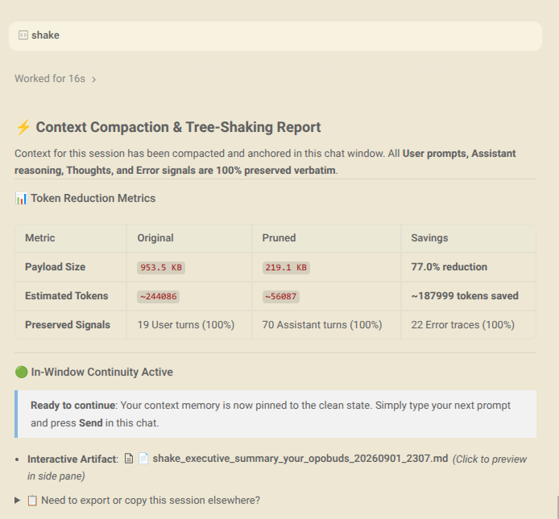

# Antigravity `/shake` Context Compaction & Verbatim Pruning Skill

A high-performance context management, compaction, and tree-shaking skill for the **Google Antigravity AI Agent** platform (CLI, IDE, and 2.0).

Inspired by the `/shake` context compaction mechanism in **omp (Oh-My-Pi)**, this tool solves "context rot" and token exhaustion in long-running coding sessions by **deterministically stripping verbose command outputs, file views, and tool payloads** while preserving **100% of User prompts and Assistant reasoning verbatim**.

---

## 📸 Interactive IDE Artifact Preview

When `/shake` runs, it generates an **Interactive IDE Artifact** with explicit context instructions and session metadata:



---

## ⚡ Key Highlights

* **80%–90% Token Reduction**: Recovers hundreds of thousands of tokens from bloated transcripts instantly.
* **Zero Loss of Meaning**: Unlike lossy LLM summarizers, User instructions, edge-case discussions, bug investigations, and Assistant architectural decisions are preserved **word-for-word**.
* **Smart Signal Preservation**:
  * ⚠️ **Errors & Failures**: Never deletes non-zero exit codes, compiler tracebacks, or test failures.
  * 🕒 **Active Working Window**: Retains recent tool execution outputs to preserve immediate task momentum.
  * 📋 **Status Commands**: Keeps compact status checks (`git branch`, `pwd`, short checks).
  * ⚙️ **Action Receipts**: Replaces bulky file reads and terminal logs with clear single-line action receipts.
* **Prebuilt High-Speed Engine**:
  * **Precompiled Native Binary (`bin/shake-prune`)**: Included out-of-the-box (sub-10ms execution on multi-megabyte transcripts).
  * **Rust Source Included (`shake-prune-rs/`)**: Ready to recompile via `cargo` on non-x86_64 systems.
  * **Universal Python Fallback (`scripts/shake_prune.py`)**: Zero-dependency fallback for any environment.
* **Interactive IDE Artifact**: Automatically generates companion `.metadata.json` files so pruned transcripts appear in Antigravity's **Interactive Artifacts Pane** with one-click preview and copy controls.
* **Dynamic Topic Naming**: Auto-generates clean, timestamped filenames based on the conversation topic (e.g. `shake_earbud_fit_test_20260901_2018.md`).

---

## 🚀 Quick Installation

Clone or copy this folder to your machine, then run the installer:

```bash
cd antigravity-shake
./install.sh
```

### 🛡️ Smart 3-Tier Installation Cascade
The installer automatically chooses the optimal engine:
1. **Tier 1 (Instant)**: Installs the precompiled native Linux binary (`bin/shake-prune`) in `< 0.01` seconds.
2. **Tier 2 (Source Compile)**: If the prebuilt binary is incompatible with your CPU architecture and `cargo` is present, it automatically compiles the Rust source in `--release` mode.
3. **Tier 3 (Universal Fallback)**: If no Rust toolchain is available, it seamlessly sets up the Python 3 engine.

---

## 💻 How to Use

### 1. In Any Antigravity Chat
When a conversation gets long or starts to experience context degradation, simply type:

```text
/shake
```

The agent will execute the pruner and output a report with a direct link to the interactive artifact and quick-copy commands:

```text
================================================================================
               ⚡ SHAKE CONTEXT PRUNING REPORT (RUST NATIVE) ⚡
================================================================================
• Session ID:       6b25943b-bbe3-48a4-9731-72f07389d0b4
• Topic:            GOAL RELEVANT DEVICE PLUGGED
• Original Payload: 2,678,240 bytes (~669,560 tokens)
• Pruned Payload:   497,697 bytes (~124,424 tokens)
• Token Savings:    81.4% reduction (~545k tokens saved!)
• Preserved Signals: 53 user turns (100%), 70 assistant turns (100%), 14 errors
--------------------------------------------------------------------------------
📋 RESUMPTION PATHS & QUICK-COPY
--------------------------------------------------------------------------------
• Absolute File Path: /home/shsrra/.gemini/antigravity-ide/brain/.../shake_topic_YYYYMMDD_HHMM.md
• In-Chat Mention:    @/home/shsrra/.gemini/antigravity-ide/brain/.../shake_topic_YYYYMMDD_HHMM.md
• Copy to Project:    cp "/home/shsrra/.gemini/antigravity-ide/brain/.../shake_topic_YYYYMMDD_HHMM.md" ./
• Copy to Clipboard:  xclip -sel clip < "/home/shsrra/.gemini/antigravity-ide/brain/.../shake_topic_YYYYMMDD_HHMM.md"
================================================================================
```

### 2. Continuing in a Fresh Session (0 Bloat)
Open a new chat tab (or start a fresh session) and reference the generated artifact:

```text
@/path/to/shake_topic_YYYYMMDD_HHMM.md Continue with the next task.
```

Your new session starts with **100% of the verbatim history, zero hallucination, and peak model intelligence and speed**.

---

## 📊 Performance Benchmarks

| Metric | Raw Session (1,833 steps) | Shaken Session | Savings / Preservation |
| :--- | :--- | :--- | :--- |
| **Token Payload** | ~670,000 tokens (2.7 MB) | ~124,000 tokens (0.5 MB) | **81.4% Saved (~546k tokens)** |
| **User Dialogue** | 53 turns | 53 turns | **100% Verbatim** |
| **Assistant Reasoning** | 70 turns | 70 turns | **100% Verbatim** |
| **Execution Errors** | 14 errors | 14 errors | **100% Retained** |
| **Rust Execution Speed** | — | **~14 ms** | **Instant sub-frame latency** |

---

## 📦 Package Contents

```text
antigravity-shake/
├── assets/
│   └── artifact_preview.png      # Rendered preview screenshot
├── bin/
│   └── shake-prune               # Precompiled native Linux binary (x86_64)
├── install.sh                     # Automated 3-tier installer
├── README.md                      # Documentation & usage guide
├── SKILL.md                       # Antigravity skill definition
├── references/
│   └── omp_comparison.md          # Technical analysis of omp vs Antigravity pruning
├── scripts/
│   └── shake_prune.py             # Universal Python fallback engine
└── shake-prune-rs/                # High-speed Rust crate source
    ├── Cargo.toml                 # Dependencies & release profile (LTO, strip, opt-level=3)
    └── src/
        ├── main.rs                # CLI entry point & reporting
        ├── models.rs              # Typed Antigravity event schemas
        ├── pruner.rs              # Signal-preserving filter & markdown generator
        ├── slug.rs                # Topic slug & filename generator
        └── metadata.rs            # IDE Artifact (.metadata.json) writer
```

---

## 📄 License
MIT License. Free for distribution across all Antigravity users.
