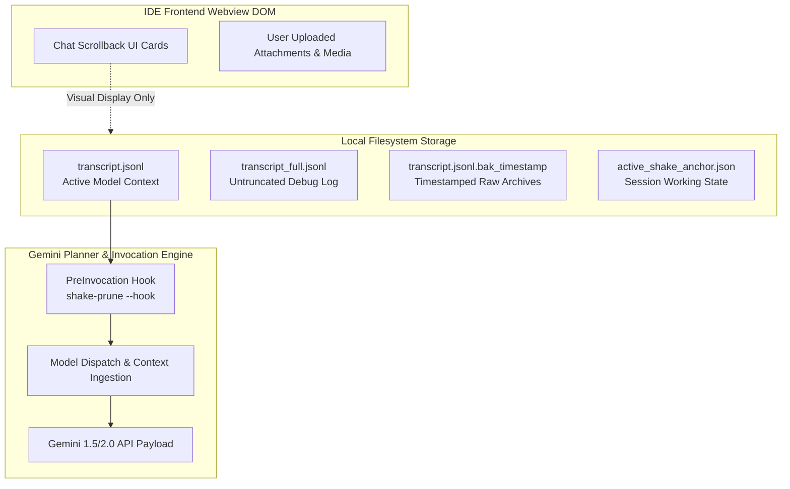
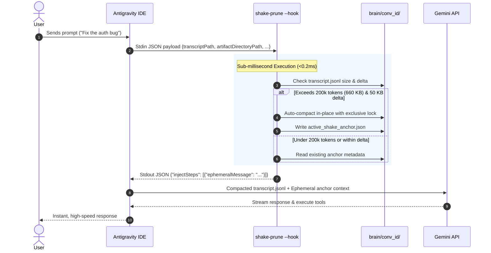
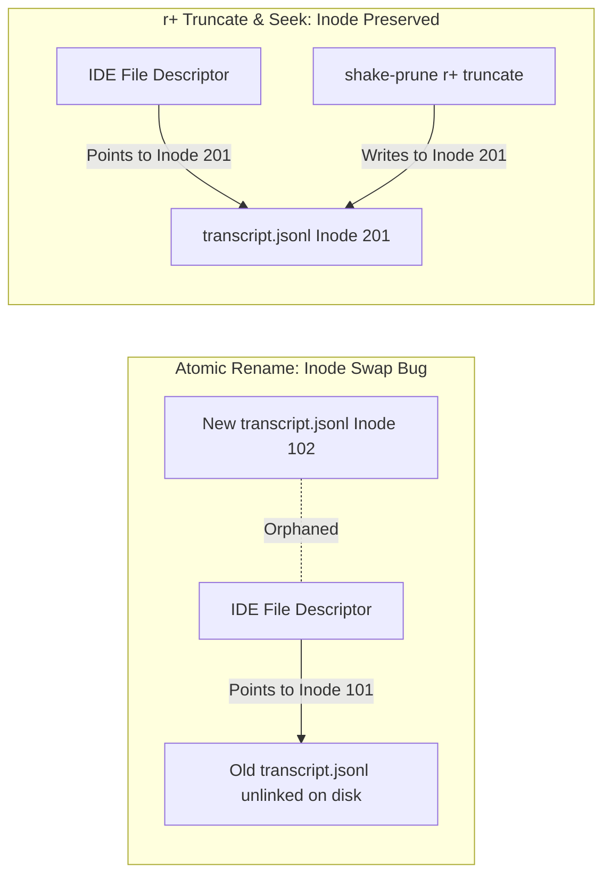

# 🧠 Google Antigravity Agent Lifecycle & Architecture Deep Dive

This document explains the internal mechanics of Google Antigravity (Gemini-powered Advanced Agentic Coding), how context is managed across backend prompt streams versus frontend UI caches, and how `/shake` achieves deterministic, in-place context tree-shaking with zero disruption to the IDE.

---

## 1. Backend Context Stream vs. Frontend UI Cache

A common point of confusion is why an AI agent might "forget" past verbose logs or become faster even though visual scrollback cards remain visible in the editor chat pane.



### The Two Separate Realities

1. **The Model Prompt Stream (`transcript.jsonl`)**:
   - On every single turn, Antigravity reads `<appDataDir>/brain/<conversation-id>/.system_generated/logs/transcript.jsonl` from disk.
   - This file represents the **exact prompt payload** sent across the wire to the Gemini API.
   - If `transcript.jsonl` contains 50,000 lines of `npm test` or `cargo build` logs, those millions of characters are re-serialized and sent to the LLM on **every turn**, causing severe token bloat, high latency, and "attention decay".

2. **The Client Webview DOM Cache**:
   - The IDE interface caches rendered message cards in memory/local webview storage so developers can scroll up and see visual history.
   - **Crucial Distinction**: The LLM *never* sees the frontend DOM cache. It only sees `transcript.jsonl`.

### How `/shake` Operates
`/shake` performs **physical in-place compaction** directly on `transcript.jsonl` and `transcript_full.jsonl`:
- It replaces verbose raw tool stdout (`RUN_COMMAND`, `VIEW_FILE`, `write_to_file`) with compact structured receipts.
- The prompt sent to Gemini immediately drops from **1.5M+ tokens down to <200k tokens** (50% to 80% physical reduction).
- The IDE frontend continues operating smoothly in the **exact same tab** without requiring tab switching or context re-initialization.

---

## 2. The Antigravity Lifecycle Hook System

Antigravity provides lifecycle extension points defined in `~/.gemini/config/hooks.json`. `/shake` hooks directly into the **`PreInvocation`** lifecycle event.

```json
{
  "hooks": {
    "PreInvocation": [
      {
        "name": "shake-anchor",
        "command": "/home/user/.gemini/bin/shake-prune --hook"
      }
    ]
  }
}
```

### The PreInvocation Lifecycle Flow



### Ephemeral Context Anchoring
Rather than permanently modifying the transcript on every turn, the hook injects an **`ephemeralMessage`**:
```text
[Context compacted via /shake. Active state anchored in @/path/to/shake_report.md (Step 379+). Treat prior raw tool stdout as archived.]
```
* This message is injected into the LLM's working prompt for that turn only.
* It anchors the model's awareness, informing it that prior commands succeeded and that full code payloads are archived on disk.
* It does not pollute the permanent JSONL log on disk.

---

## 3. The 200k Proactive Auto-Shake Engine

To prevent users from having to manually remember to run `/shake` during long sessions, `shake-prune` includes an automated background trigger:

1. **Sub-Millisecond Stat Check (`<0.01ms`)**:
   On every user turn, the hook checks `fs::metadata(transcript_path).len()`.
2. **Calibrated Code/JSON Threshold**:
   - Code and JSON transcripts average **3.3 bytes/token** (due to 20.7% punctuation/symbol density).
   - $\text{Threshold} = 200,000 \times 3.3 = 660,000 \text{ bytes (645 KB)}$.
3. **The 50 KB Growth Delta Guard**:
   If the clean dialogue (user prompts + thoughts) alone exceeds 200k tokens, the engine compares the current size against `last_compacted_bytes`:
   $$\text{current\_size} > \text{last\_compacted\_size} + 50,000\text{ bytes}$$
   If less than 50 KB of new content has accumulated, the hook immediately exits in `<0.2ms` without running disk compaction.
4. **180s Cooldown Guard**:
   Prevents tight CPU looping in failure or edge-case conditions.

---

## 4. Inode Preservation & Cross-Platform Concurrency

When modifying an active log file that a host IDE is currently writing to, standard file replacement (`fs::rename` / `os.replace`) causes a fatal **Inode Swap**:



### In-Place Truncate-and-Rewrite Implementation

1. **Exclusive Cross-Platform File Locking (`fs2`)**:
   ```rust
   let mut file = File::options().read(true).write(true).open(&abs_target)?;
   file.lock_exclusive()?;
   ```
   Ensures that neither the IDE nor background agent tasks can write mid-compaction.
2. **In-Place Truncation & Rewind**:
   ```rust
   file.set_len(0)?;
   file.seek(SeekFrom::Start(0))?;
   file.write_all(compacted_output.as_bytes())?;
   file.flush()?;
   file.sync_all()?; // fsync commits bytes to physical disk
   file.unlock()?;
   ```
3. **Result**: The file descriptor held by the Antigravity IDE stays synchronized on the exact same inode. Subsequent turns append cleanly without data loss or corruption.

---

## 5. Progressive Disclosure & Historical Recovery

`/shake` never destroys code or makes irreversible deletions:

1. **Timestamped Non-Destructive Backups**:
   Every pass generates a uniquely timestamped snapshot:
   ```text
   transcript.jsonl.bak_20260902_005415
   ```
2. **Canonical Absolute Backlinks**:
   Older `write_to_file` and `replace_file_content` payloads are replaced with structured receipts containing the exact step index and absolute archive path:
   ```json
   {
     "name": "write_to_file",
     "args": {
       "TargetFile": "/path/to/src/main.rs",
       "CodeContent": "[File written to disk (140 lines). Step 42 full payload archived in /home/.../transcript.jsonl.bak_20260902_005415. Inspect via view_file if needed]"
     }
   }
   ```
3. **On-Demand Recovery**: If a user later asks *"revert the hook changes made around step 40"*, the LLM reads the preserved dialogue history, retrieves the archive link from the receipt, and inspects the raw code via `view_file` to restore the code verbatim.
